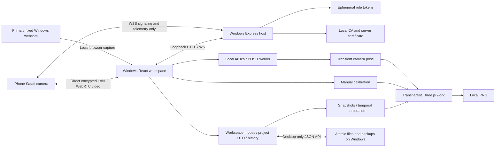

# Architecture

Server coordinates signaling, never camera frames. The desktop receives frames
directly and performs local vision. DOM media is layer one; fitted transparent
WebGL is layer two; marker outlines and application UI occupy later layers.
Project data and camera state are independent.

| Boundary | Location | Ownership |
| --- | --- | --- |
| Camera workspace | apps/desktop-web/src/DesktopApp.tsx | Existing phone/webcam/file/sample sources |
| Planner | apps/desktop-web/src/planner | Store, modes, panels, dialogs, commands and playback |
| Safari sender | apps/phone-camera | Permission, rear preference, preview/switch/stop |
| Host / transport | apps/server; packages/shared | HTTPS, QR sessions, relay and PeerLink |
| DTOs | packages/shared/src/project.ts | Versioned schemas, no GPU objects |
| 3D | packages/three-engine | Projection, models, raycast, controls and disposal |
| Geometry | packages/room-engine | Manual calibration, catalog, distance, overlap and history |
| Vision | packages/vision | Worker detection and filtered floor-camera pose |
| Time | packages/layouts | Lifecycle, interpolation and demo |
| Storage | packages/persistence | Atomic JSON and valid previous backup |

HTTP desktop binds 127.0.0.1:5173, LAN HTTPS/WSS uses 5443, certificate-only HTTP
uses 5442. Pairing/storage require loopback and desktop header. Camera credentials
cannot authorize desktop. No external STUN/TURN, audio, cloud recording or native
iOS dependency is used.
