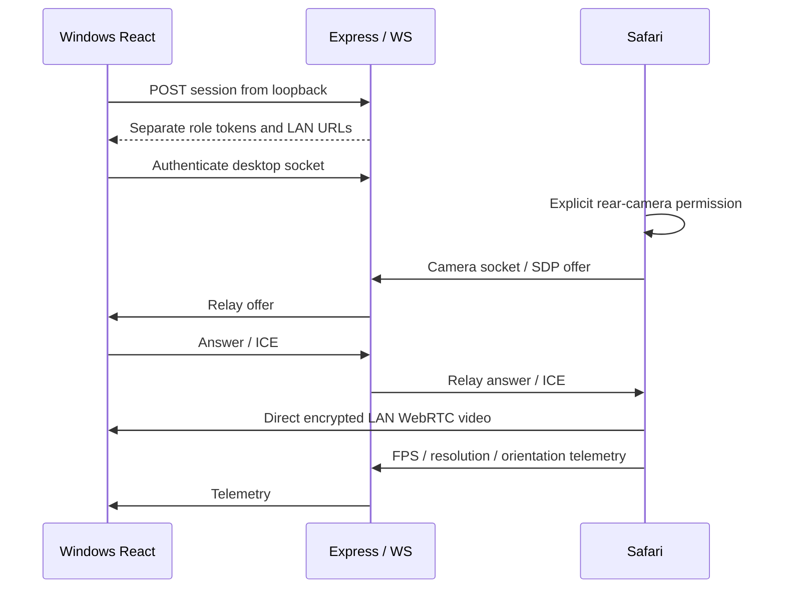
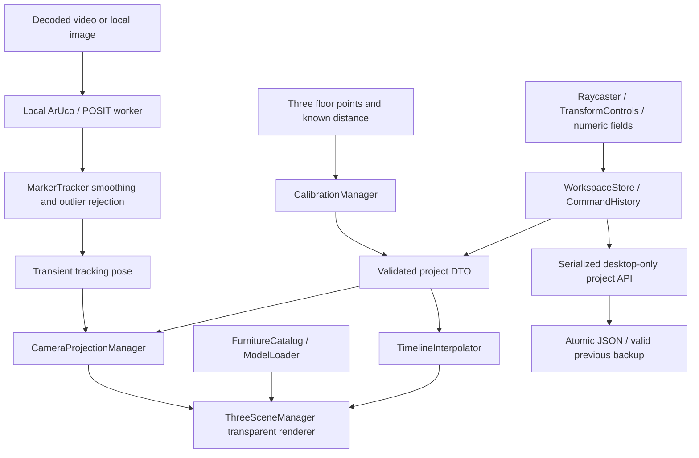

# Detailed Design Specification

## Camera And Realtime

Existing DesktopApp and CameraApp remain the capture owners. PeerLink owns
the secondary, opt-in phone transport. Windows webcam is selected by default,
starts after an explicit permission gesture, and uses a fixed-camera manual
reference. No phone session or vision worker is created for that workflow.
Recalibrate invalidates the reference, clears transient selection/tracking and
floor clicks, and retains project room content. PeerLink owns
RTCPeerConnection, serialized SDP, queued ICE and capped WebSocket retries.
SessionStore creates independent 256-bit role secrets with four-hour expiry.
Signaling validates origin, schema, rate and payload size, limits each role to
one peer and uses heartbeat checks.

Video never passes through server storage. Live status also requires playback;
FPS comes from decoded frames. Source switching releases webcam tracks. The CA
bootstrap serves exact public certificate bytes from hidden .local, never keys.

## Spatial Pipeline

## Three.js

World is Y-up, X width, Z depth, Y=0 floor and one unit=one meter.
ThreeSceneManager owns renderer, scene, lighting, grid/axes, room bounds,
instance groups, selection helpers and TransformControls. DTO reconciliation
never puts GPU objects in project state. Async model requests have identity
guards and stale results are disposed. ObjectRaycaster intersects floor or
instance descendants. ModelLoader builds nine primitives; optional local GLB
loading uses GLTFLoader, normalizes dimensions and places the base on the floor.
CameraProjectionManager uses the same contain/cover rectangle and crop offsets
as media. ResizeObserver and decoded dimensions synchronize projection.
ThreeOverlay coordinates React mounting, pointer events, worker lifetime and RAF;
geometry/calibration/interpolation remain in packages.

## Calibration And Vision

Calibration stores method, camera position, normalized quaternion, origin, Euler
corrections, scale, vertical FOV, marker side length and known A-B distance.
Manual calibration raycasts A/B/C through the assumed camera, rejects coincident
or collinear points, maps A to origin and A-B to X, and rescales by measured A-B.
It is not camera-intrinsic estimation or automatic floor discovery.

The classic worker loads installed js-aruco2 scripts locally, detects dictionary
ARUCO_MIP_36h12 ID 100 and computes POSIT pose with side length and assumed focal
length. MarkerTracker converts to Y-up floor coordinates, smooths position and
quaternion by 0.25 and rejects >2 m jumps during continuous tracking. After loss,
reacquisition can accept a changed position. One second without a valid pose
reports TrackingLost and holds the last pose. Runtime poses are transient,
avoiding autosave on every detection. Manual fallback remains available.

## Furniture, Measurements And History

Furniture DTOs carry UUID identity, supported catalog ID, position, Euler radians,
scale, visibility and lock. Schema rejects duplicate IDs and conflicting catalog
IDs for the same temporal instance. Ghosts are transient. Floor move constrains
gizmo Y; numeric Y allows explicit vertical adjustment. Scale is bounded 0.1-5.
Overlap is advisory transformed axis-aligned Box3 intersection, not physics.
Measurements store name/endpoints/visibility and Euclidean calibrated-world
distance; they belong to the room, not individual states. CommandHistory
deep-copies up to 100 project snapshots and clears redo after new edits.

## Layouts And Timeline

Each layout is an independent complete snapshot. Duplicate state retains temporal
IDs; duplicate furniture creates a new ID. At least one state remains. Array
order defines T. Interpolation matches IDs, lerps position/scale, converts stored
Euler rotations to quaternion slerp, and fades/scales additions/removals or
visibility changes. Runtime transforms do not alter snapshots. Durations are
0.5-5 seconds per segment; linear or cubic ease-in-out and playback speeds are
selectable. Scissored compare passes share one projection for wipe/split, while
toggle renders one state. PNG capture composites fitted media and transparent
WebGL at 2x CSS size or excludes media.

## Persistence, UI And Errors

ProjectRepository validates schemaVersion 1, restricts filenames to UUIDs,
serializes writes per ID, writes a unique temporary file, keeps the last valid
previous JSON as .bak, then renames over current JSON. Corrupt projects are listed
and offer backup recovery. APIs require loopback and desktop header. Import
validates before replacing state; unsaved replacement asks confirmation. The
client clears dirty only if the saved snapshot is still the loaded snapshot.

React external-store snapshots coordinate eight explicit modes. Selection, ghost,
playback and tracking are transient. Panels have numeric/select/checkbox controls,
native confirmations and toasts. Help includes an eight-step remembered tour.
AppErrorBoundary catches rendering failures; capture, WebGL, worker, storage and
import failures show actionable feedback. Lazy phone/desktop entry points keep
the Three.js editor out of the phone bundle. Resources are disposed on unmount.
